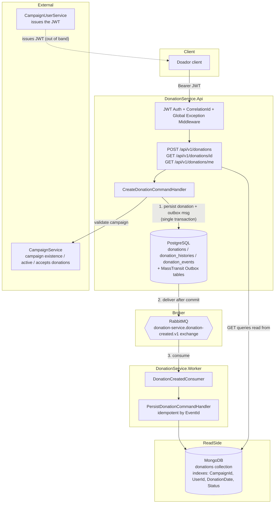
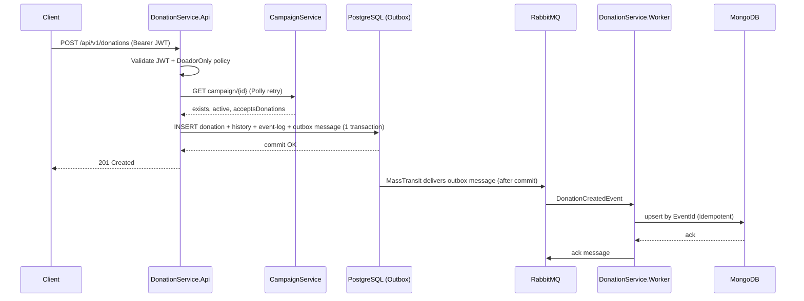

# DonationService

Production-ready .NET 9 microservice that processes donations made by authenticated `Doador` users. It validates the caller's JWT (issued by **CampaignUserService**), validates the target campaign against **CampaignService**, persists the donation request transactionally in PostgreSQL, and publishes a `DonationCreatedEvent` to RabbitMQ - via a transactional Outbox, so no event is ever lost or published for a donation that failed to save. An independent Worker consumes that event and materializes the donation as a document in MongoDB, the service's read model.

DonationService **does not manage users**. It trusts the JWT issued by CampaignUserService and never issues or refreshes tokens itself.

---

## Table of contents

1. [Architecture](#architecture)
2. [Project structure](#project-structure)
3. [Donation flow](#donation-flow)
4. [Event-driven architecture](#event-driven-architecture)
5. [The `DonationCreatedEvent` contract](#the-donationcreatedevent-contract)
6. [RabbitMQ topology, retry & DLQ strategy](#rabbitmq-topology-retry--dlq-strategy)
7. [Outbox pattern](#outbox-pattern)
8. [MongoDB configuration](#mongodb-configuration)
9. [PostgreSQL / Supabase configuration](#postgresql--supabase-configuration)
10. [Environment variables](#environment-variables)
11. [Running locally with Docker Compose](#running-locally-with-docker-compose)
12. [Running without Docker](#running-without-docker)
13. [API reference & examples](#api-reference--examples)
14. [Health checks & observability](#health-checks--observability)
15. [Testing](#testing)
16. [Security notes](#security-notes)

---

## Architecture

Clean Architecture, with two independent runnable hosts (`Api` and `Worker`) sharing the same `Domain`/`Application`/`Infrastructure` core.



- **DonationService.SharedKernel** - `BaseEntity`, `Result`/`Result<T>`, `Error`/`ErrorType`, `AppException` hierarchy, `ICurrentUserService`, `IDateTimeProvider`. No dependencies.
- **DonationService.Contracts** - versioned integration event contracts (`DonationCreatedEvent`). Referenced by `Application`, `Infrastructure`, and `Worker`.
- **DonationService.Domain** - `Donation` (aggregate root), `DonationHistory`, `DonationEvent`, enums, domain exceptions, repository interfaces (`IUnitOfWork`, `IDonationRepository`, `IDonationReadRepository`, ...), and the storage-agnostic `DonationReadModel`.
- **DonationService.Application** - CQRS via MediatR, organized by feature (`Features/Donations/{Commands,Queries,DTOs,Mappings}`), FluentValidation validators, AutoMapper profiles, pipeline behaviors (`ValidationBehavior`, `LoggingBehavior`), and the Gateway abstractions `ICampaignServiceClient` / `IEventPublisher`.
- **DonationService.Infrastructure** - EF Core 9 + Npgsql (`DonationDbContext`, repositories, `UnitOfWork`), MongoDB.Driver (`DonationReadRepository`, index bootstrap), MassTransit + RabbitMQ (producer and consumer registration, transactional EF Outbox), `CampaignServiceHttpClient` (HttpClientFactory + Polly), `CurrentUserService` (JWT claims).
- **DonationService.Api** - ASP.NET Core 9 minimal APIs, JWT Bearer auth + policy-based RBAC, Swagger, Serilog, health checks, API versioning, global exception middleware.
- **DonationService.Worker** - `Microsoft.NET.Sdk.Worker` host running the MassTransit consumer bus, with a minimal Kestrel endpoint for health checks.

Dependency rule: `Api`/`Worker` → `Infrastructure` → `Application` → `Domain` → `SharedKernel`, with `Contracts` referenced wherever integration events are produced/consumed. Nothing in `Domain` or `Application` references ASP.NET Core, EF Core, MongoDB.Driver, or MassTransit types directly - only through the interfaces `Application` declares.

## Project structure

```
DonationService/
├── src/
│   ├── DonationService.SharedKernel/
│   ├── DonationService.Contracts/
│   │   └── Events/V1/DonationCreatedEvent.cs
│   ├── DonationService.Domain/
│   │   ├── Entities/ (Donation, DonationHistory, DonationEvent)
│   │   ├── ReadModels/DonationReadModel.cs
│   │   └── Repositories/ (IUnitOfWork, IDonationRepository, IDonationReadRepository, ...)
│   ├── DonationService.Application/
│   │   └── Features/Donations/{Commands,Queries,Dtos,Mappings}
│   ├── DonationService.Infrastructure/
│   │   ├── Persistence/ (DonationDbContext, Configurations, Repositories, Mongo/)
│   │   ├── Messaging/ (MassTransitEventPublisher, RabbitMqSettings, DonationCreatedTopology)
│   │   └── ExternalServices/CampaignServiceHttpClient.cs
│   ├── DonationService.Api/
│   │   ├── Endpoints/DonationEndpoints.cs
│   │   ├── Middleware/ (GlobalExceptionMiddleware, CorrelationIdMiddleware)
│   │   └── Program.cs
│   └── DonationService.Worker/
│       ├── Consumers/DonationCreatedConsumer.cs
│       └── Program.cs
├── tests/
│   ├── DonationService.UnitTests/
│   ├── DonationService.IntegrationTests/   (Api only - see note below)
│   └── DonationService.ConsumerTests/      (Worker only - see note below)
├── sql/schema.sql
├── mongo-init/init-mongo.js
├── docker/Dockerfile.Api, docker/Dockerfile.Worker
├── docker-compose.yml, docker-compose.override.yml
└── .env.example
```

> **Why two test projects instead of one?** `DonationService.Api` and `DonationService.Worker` are both top-level-statement executables, and top-level statements always compile into an implicit `Program` class in the *global namespace* with no way to rename or namespace it. Referencing both from a single test assembly produces an ambiguous `Program` symbol (CS0433). `IntegrationTests` references only `Api`; `ConsumerTests` references only `Worker`.

## Donation flow

1. Client calls `POST /api/v1/donations` with `Authorization: Bearer <jwt>`.
2. JWT Bearer authentication validates the token's signature, issuer, audience and expiry (the same key/issuer/audience configured on CampaignUserService).
3. The `DoadorOnly` authorization policy requires the `Doador` role claim - enforced entirely through `[RequireAuthorization]`/policies, never through manual `User.IsInRole()` checks in application code.
4. `CreateDonationCommandValidator` (FluentValidation) checks: CampaignId present, Value > 0, Currency is one of BRL/USD/EUR, PaymentMethod is a recognized value, and the caller is a fully authenticated user with an identity.
5. `CreateDonationCommandHandler` calls `ICampaignServiceClient.ValidateCampaignAsync` (HttpClientFactory + Polly retry/circuit-breaker) to confirm the campaign exists, is active, and accepts donations.
6. On success: a `Donation` aggregate is created (status `PendingPublish`), a `DonationHistory` audit row is added, a `DonationCreatedEvent` is published through `IEventPublisher` (captured by the MassTransit EF Outbox, not yet delivered), a `DonationEvent` audit-log row is added, the donation is marked `Published`, and **one single `SaveChangesAsync` call** commits the donation, its history, its event log, and the outbox message atomically.
7. Only after that Postgres transaction commits does MassTransit's outbox delivery service hand the message to RabbitMQ.
8. `DonationService.Worker`'s `DonationCreatedConsumer` consumes the event and dispatches `PersistDonationCommand`, which upserts the donation into MongoDB - idempotently, keyed by `EventId`.
9. `GET /api/v1/donations/{id}` and `GET /api/v1/donations/me` read exclusively from MongoDB (the read model). A donation created moments ago may briefly 404 until the Worker catches up - this is a deliberate, documented eventual-consistency trade-off of the event-driven design.

## Event-driven architecture



## The `DonationCreatedEvent` contract

`DonationService.Contracts/Events/V1/DonationCreatedEvent.cs`:

```csharp
namespace DonationService.Contracts.Events.V1;

public sealed record DonationCreatedEvent(
    Guid EventId,
    Guid CorrelationId,
    Guid DonationId,
    Guid CampaignId,
    Guid UserId,
    string UserName,
    string UserEmail,
    decimal Value,
    string Currency,
    string PaymentMethod,
    DateTime DonationDate,
    DateTime CreatedAt) : IIntegrationEvent;
```

Notes:

- **`PaymentMethod` was added** beyond the literal field list given in the original spec, because the Worker needs it to build a complete MongoDB document without a second round trip back to Postgres.
- **Versioning convention:** the contract lives under the `V1` namespace. A backward-incompatible change must be introduced as `DonationService.Contracts.Events.V2.DonationCreatedEvent` (with its own routing key/exchange binding), never by mutating this record - so consumers already processing V1 messages (including anything sitting in the `_error` queue) keep working unmodified.
- `EventId` doubles as the consumer's idempotency key.
- `CorrelationId` ties the event back to the originating HTTP request and is propagated through Serilog's `LogContext` on both sides.

## RabbitMQ topology, retry & DLQ strategy

| Concept | Value |
|---|---|
| Exchange | `donation-service.donation-created.v1` |
| Routing key | `donation.created.v1` |
| Queue (consumer) | `donation-created-queue` (configurable via `RabbitMq:DonationCreatedQueueName`) |
| Durability | Durable exchange + durable queue; MassTransit publishes messages as persistent by default |
| PrefetchCount | 16 (configurable via `RabbitMq:PrefetchCount`) |
| ConcurrencyLimit | 8 (configurable via `RabbitMq:ConcurrencyLimit`) |
| Retry | 5 attempts, 5s interval (configurable via `RabbitMq:RetryCount` / `RabbitMq:RetryIntervalSeconds`) |
| Dead-letter handling | MassTransit's RabbitMQ transport convention: once retries are exhausted, the faulted message is moved to `donation-created-queue_error` - this **is** the DLQ for this service |

`Program.cs` (Worker) → `AddDonationServiceConsumerMessaging<DonationCreatedConsumer>` wires an explicit `ReceiveEndpoint` (not the default convention-based endpoint naming) so the queue name, binding, prefetch, concurrency and retry are all deterministic and documented in one place (`DonationService.Infrastructure/DependencyInjection.cs`).

Consumer idempotency is handled at the application level rather than via a full MassTransit consumer inbox: `PersistDonationCommandHandler` checks `IDonationReadRepository.ExistsByEventIdAsync(EventId)` before writing, and the MongoDB `donations` collection also enforces a **unique index on `eventId`** as a hard backstop.

## Outbox pattern

`DonationDbContext` provisions MassTransit's own Entity Framework Bus Outbox tables (`inbox_state`, `outbox_message`, `outbox_state`) alongside the service's own tables, via `modelBuilder.AddInboxStateEntity()/AddOutboxMessageEntity()/AddOutboxStateEntity()`.

`AddDonationServiceProducerMessaging` (used only by the **Api**, never the Worker) configures:

```csharp
x.AddEntityFrameworkOutbox<DonationDbContext>(o =>
{
    o.UsePostgres();
    o.UseBusOutbox();
});
```

Because `CreateDonationCommandHandler` calls `IEventPublisher.PublishAsync(...)` (wrapping MassTransit's `IPublishEndpoint`) *before* calling `IUnitOfWork.SaveChangesAsync(...)`, and both run inside the same DI scope/DbContext instance, MassTransit intercepts the publish call and writes it as an `outbox_message` row in the very same transaction as the `Donation`/`DonationHistory`/`DonationEvent` rows. If the transaction rolls back, nothing is queued for delivery. If it commits, a background delivery service (`UseBusOutbox()`) picks the row up and hands it to RabbitMQ - guaranteeing "commit implies eventually delivered" without a two-phase commit across Postgres and RabbitMQ.

## MongoDB configuration

Collection: `donations` (configurable via `MongoDb:DonationsCollectionName`), database `donation_service` (configurable via `MongoDb:DatabaseName`).

Indexes (created both by `mongo-init/init-mongo.js` on first container boot, and idempotently re-verified at application startup by `MongoIndexInitializer`, an `IHostedService` registered in both `Api` and `Worker`):

| Index | Fields | Purpose |
|---|---|---|
| `ix_donations_campaignId` | `campaignId: 1` | `GET .../campaigns/{id}` listing (future GestorOng dashboard) |
| `ix_donations_userId` | `userId: 1` | `GET /api/v1/donations/me` |
| `ix_donations_donationDate` | `donationDate: -1` | Chronological listing/sorting |
| `ix_donations_status` | `status: 1` | Status-based filtering/reporting |
| `ux_donations_eventId` (unique) | `eventId: 1` | Consumer idempotency backstop |

## PostgreSQL / Supabase configuration

DonationService uses Postgres **only** for what it owns transactionally: the `donations`, `donation_histories`, `donation_events` tables, and MassTransit's outbox tables - never for donation reads.

Because no `dotnet ef` tooling was available while building this service, the schema is provided as a hand-written, idempotent bootstrap script at `sql/schema.sql` (mirrors the EF Core fluent configuration in `Infrastructure/Persistence/Configurations/` exactly). Run it once against your Supabase project before first start:

```bash
psql "$DONATIONSERVICE_DB_CONNECTION" -f sql/schema.sql
```

Or paste its contents into the Supabase SQL Editor. It is idempotent (`CREATE TABLE IF NOT EXISTS`, `CREATE INDEX IF NOT EXISTS`) - safe to re-run.

## Environment variables

All configuration is environment-variable/appsettings-driven; **no secrets are hard-coded**. Copy `.env.example` to `.env` and fill in real values.

| Variable | Used by | Description |
|---|---|---|
| `DONATIONSERVICE_DB_CONNECTION` | Api | Npgsql connection string (Supabase or local Postgres) |
| `MONGODB_CONNECTION` / `MONGO_DATABASE` | Api, Worker | MongoDB connection string and database name |
| `RABBITMQ_HOST` / `RABBITMQ_USER` / `RABBITMQ_PASSWORD` / `RABBITMQ_AMQP_PORT` | Api, Worker | RabbitMQ connection |
| `JWT_ISSUER` / `JWT_AUDIENCE` / `JWT_SECRET_KEY` | Api | Must match CampaignUserService's issuer/audience/signing key exactly |
| `CAMPAIGN_SERVICE_BASE_URL` | Api | Base URL of the CampaignService/CampaignUserService campaign-lookup endpoint |
| `API_PORT` / `WORKER_PORT` | Docker Compose | Host ports the containers are published on |

## Running locally with Docker Compose

```bash
cp .env.example .env
# edit .env with real Supabase/JWT values

# start Mongo, RabbitMQ, the Api and the Worker (Postgres is external/Supabase by default)
docker compose up --build

# OR, to also run a local Postgres container instead of Supabase:
docker compose --profile local-db up --build
```

- Swagger UI (Development only): `http://localhost:8080/swagger`
- RabbitMQ management UI: `http://localhost:15672` (guest/guest by default)
- Api health: `http://localhost:8080/health`, `/health/live`, `/health/ready`
- Worker health: `http://localhost:8081/health`, `/health/live`, `/health/ready`

`docker-compose.override.yml` is applied automatically by `docker compose up` and sets `ASPNETCORE_ENVIRONMENT=Development` plus exposes the RabbitMQ/Mongo ports for local inspection.

## Running without Docker

1. Provision Postgres (Supabase) and run `sql/schema.sql` against it.
2. Run MongoDB and RabbitMQ locally (or point at hosted instances).
3. Set the environment variables above (or edit `appsettings.Development.json` in each project).
4. `dotnet run --project src/DonationService.Api`
5. `dotnet run --project src/DonationService.Worker`

## API reference & examples

All endpoints are versioned under `/api/v1` and require `Authorization: Bearer <jwt>` unless noted.

### `POST /api/v1/donations` (Doador only)

```http
POST /api/v1/donations HTTP/1.1
Authorization: Bearer eyJhbGciOi...
Content-Type: application/json

{
  "campaignId": "8f14e45f-ceea-4d1d-8c1c-1a2b3c4d5e6f",
  "value": 150.00,
  "currency": "BRL",
  "paymentMethod": "Pix"
}
```

`201 Created`:

```json
{
  "donationId": "3fa85f64-5717-4562-b3fc-2c963f66afa6",
  "campaignId": "8f14e45f-ceea-4d1d-8c1c-1a2b3c4d5e6f",
  "value": 150.00,
  "currency": "BRL",
  "paymentMethod": "Pix",
  "donationDate": "2026-07-27T14:02:11.123Z",
  "status": "Published"
}
```

Error responses follow RFC 7807 `ProblemDetails`, e.g. campaign not found:

```json
{
  "status": 404,
  "title": "campaign_not_found",
  "type": "https://donationservice.errors/campaign_not_found",
  "detail": "Campaign '8f14e45f-ceea-4d1d-8c1c-1a2b3c4d5e6f' was not found.",
  "correlationId": "8b1e...",
  "traceId": "00-..."
}
```

### `GET /api/v1/donations/{id}`

Returns the donation from the MongoDB read model. Accessible by the donation's own Doador or by any GestorOng. Returns `403` for anyone else, `404` if the Worker hasn't materialized it yet.

### `GET /api/v1/donations/me?page=1&pageSize=20`

Lists the authenticated user's own donations, paginated, sorted by `donationDate` descending.

## Health checks & observability

- `/health` - full report (all checks, formatted via `HealthChecks.UI.Client`)
- `/health/live` - liveness only (no dependency checks - "is the process up")
- `/health/ready` - readiness (Postgres, MongoDB, RabbitMQ - tagged `ready`)
- Serilog structured logging (console + rolling file), enriched with `CorrelationId`, exception details, and environment name, on both `Api` and `Worker`.
- `CorrelationIdMiddleware` (Api) reads/generates `X-Correlation-Id`, stores it on `HttpContext.Items`, pushes it into Serilog's `LogContext`, and echoes it on the response. The Worker's `AmbientCorrelationCurrentUserService` flows the event's own `CorrelationId` into the same MediatR `LoggingBehavior`, so a single donation is traceable end to end across both processes' logs.
- OpenTelemetry is not wired by default (no OTLP collector assumed in this environment) but every extension point (health checks, Serilog enrichers, CorrelationId propagation) is already in place to add `OpenTelemetry.Extensions.Hosting` with ASP.NET Core/HttpClient/Npgsql/MongoDB instrumentation with minimal changes.

## Testing

- **`DonationService.UnitTests`** - domain invariants (`Donation.Create` fail-fast rules), `CreateDonationCommandHandler` (campaign-not-found/inactive/not-accepting/happy-path), `CreateDonationCommandValidator`, `PersistDonationCommandHandler` idempotency, `GetDonationByIdQueryHandler` ownership/GestorOng authorization rules.
- **`DonationService.IntegrationTests`** - `WebApplicationFactory<Program>` against **real** Postgres/MongoDB/RabbitMQ containers via Testcontainers (`DonationServiceApiFactory`), with `ICampaignServiceClient` swapped for a stub. Covers 401 (no token), 403 (wrong role), 201 (happy path), 404 (unknown campaign). Requires a running Docker daemon.
- **`DonationService.ConsumerTests`** - `DonationCreatedConsumer` exercised through MassTransit's in-memory test harness (`AddMassTransitTestHarness`), with `ISender` mocked, verifying the consumer maps the event correctly and faults appropriately on handler failure (feeding the retry/DLQ path).

```bash
dotnet test
```

## Security notes

- DonationService **never issues or validates credentials** beyond checking a JWT's signature/issuer/audience/expiry - user management is entirely CampaignUserService's responsibility.
- RBAC is enforced exclusively through ASP.NET Core `AuthorizationPolicy` (`DoadorOnly`, `GestorOngOnly`) - there is no `User.IsInRole()` call anywhere in the codebase.
- All exceptions are converted to RFC 7807 `ProblemDetails` by `GlobalExceptionMiddleware`; raw exceptions/stack traces are only included in the response when `ASPNETCORE_ENVIRONMENT=Development`.
- Secrets (`Jwt:SecretKey`, connection strings) are read exclusively from configuration/environment variables - `appsettings.json` ships with `__SET_ME__` placeholders, never real values.
