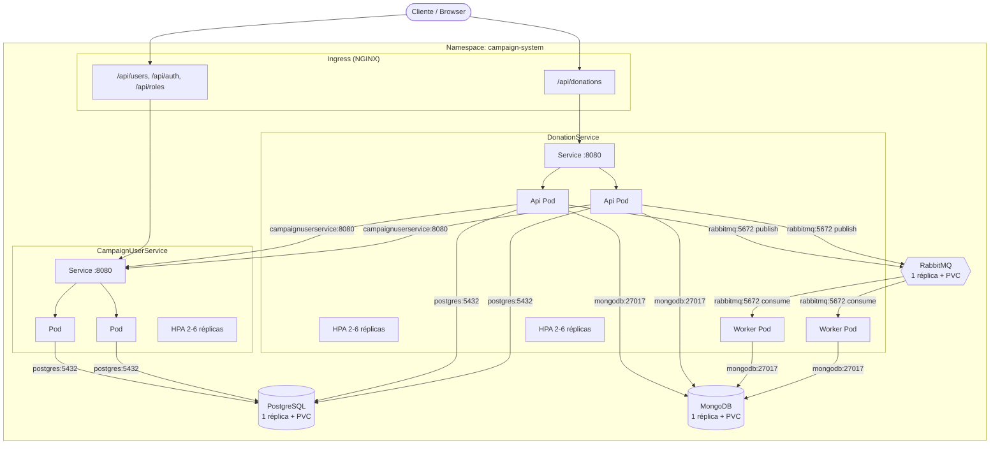

# campaign-system - Infraestrutura Kubernetes

Infraestrutura Kubernetes completa, via **Kustomize**, para executar CampaignUserService, DonationService (Api + Worker), PostgreSQL, MongoDB e RabbitMQ localmente em Minikube, Kind ou Docker Desktop Kubernetes - sem qualquer alteração no código dos microsserviços. Deploy completo com um único comando:

```bash
kubectl apply -k k8s/
```

---

## Índice

1. [Arquitetura](#arquitetura)
2. [Diagrama dos componentes](#diagrama-dos-componentes)
3. [Explicação de cada Deployment](#explicação-de-cada-deployment)
4. [Configuração dos Secrets](#configuração-dos-secrets)
5. [Configuração dos ConfigMaps](#configuração-dos-configmaps)
6. [Como criar o cluster local](#como-criar-o-cluster-local)
7. [Como realizar o deploy](#como-realizar-o-deploy)
8. [Como atualizar imagens](#como-atualizar-imagens)
9. [Como escalar os microsserviços](#como-escalar-os-microsserviços)
10. [Como visualizar logs](#como-visualizar-logs)
11. [Como acessar RabbitMQ Management](#como-acessar-rabbitmq-management)
12. [Como acessar PostgreSQL](#como-acessar-postgresql)
13. [Como acessar MongoDB](#como-acessar-mongodb)
14. [Como remover toda a infraestrutura](#como-remover-toda-a-infraestrutura)
15. [Segurança](#segurança)
16. [Desvios do template solicitado](#desvios-do-template-solicitado)

---

## Arquitetura

Namespace único `campaign-system`, com cada componente em um Deployment/Pod independente, comunicando-se exclusivamente via DNS interno do Kubernetes (nome do Service como hostname) - nenhum IP fixo é usado em lugar nenhum.

| Componente | Pods | Tipo de Service | Persistência |
|---|---|---|---|
| `postgres` | 1 (Recreate) | ClusterIP | PVC 2Gi |
| `mongodb` | 1 (Recreate) | ClusterIP | PVC 2Gi |
| `rabbitmq` | 1 (Recreate) | ClusterIP | PVC 1Gi |
| `campaignuserservice` | 2-6 (HPA) | ClusterIP + Ingress | - (stateless) |
| `donationservice-api` | 2-6 (HPA) | ClusterIP + Ingress | - (stateless) |
| `donationservice-worker` | 2-6 (HPA) | ClusterIP | - (stateless) |

Bancos de dados usam `strategy.type: Recreate` (não RollingUpdate) porque cada um é apoiado por um único PVC `ReadWriteOnce` - dois processos de banco não podem compartilhar o mesmo diretório de dados simultaneamente.

## Diagrama dos componentes



## Explicação de cada Deployment

- **`postgres`** (`postgres/deployment.yaml`) - imagem `postgres:16-alpine`. Recebe `POSTGRES_USER`/`POSTGRES_PASSWORD` do Secret `postgres-secret` e `POSTGRES_DB` do ConfigMap `campaignuserservice-config`. Monta o PVC `postgres-pvc` em `/var/lib/postgresql/data` e o ConfigMap `postgres-init-sql` (dois scripts SQL, um por serviço) em `/docker-entrypoint-initdb.d/`, executado automaticamente apenas na primeira inicialização de um volume vazio.
- **`mongodb`** (`mongodb/deployment.yaml`) - imagem `mongo:7`, iniciada com `--auth`. Recebe `MONGO_INITDB_ROOT_USERNAME`/`PASSWORD` do Secret `mongodb-secret`. Monta o PVC `mongodb-pvc` em `/data/db`.
- **`rabbitmq`** (`rabbitmq/deployment.yaml`) - imagem `rabbitmq:3.13-management-alpine` (inclui o plugin de management). Recebe `RABBITMQ_DEFAULT_USER`/`PASS` do Secret `rabbitmq-secret`. Expõe `5672` (AMQP) e `15672` (management UI). Monta o PVC `rabbitmq-pvc` em `/var/lib/rabbitmq`.
- **`campaignuserservice`** (`campaignuserservice/deployment.yaml`) - imagem `campaignuserservice-api:local`, 2 réplicas, `RollingUpdate` (`maxUnavailable: 0`, `maxSurge: 1`, `revisionHistoryLimit: 5`). ServiceAccount dedicada, `securityContext` não-root (uid/gid 1000), `readOnlyRootFilesystem: true` com `emptyDir` em `/tmp` e `/app/logs`. `startupProbe`/`livenessProbe` em `/health/live`, `readinessProbe` em `/health/ready`.
- **`donationservice-api`** (`donationservice/deployment.yaml`) - imagem `donationservice-api:local`, mesma postura de segurança/probes/rolling update do item anterior, na porta 8080.
- **`donationservice-worker`** (`donationservice/worker-deployment.yaml`) - imagem `donationservice-worker:local`, consumidor assíncrono do RabbitMQ (`DonationCreatedEvent` → MongoDB). Mesma postura de segurança/probes/rolling update, na porta 8081. Ver [Desvios do template solicitado](#desvios-do-template-solicitado) sobre por que este componente existe além do único "DonationService" citado no enunciado.

## Configuração dos Secrets

Nenhum segredo aparece em ConfigMap, Deployment ou imagem. Todos os microsserviços os consomem exclusivamente via `env[].valueFrom.secretKeyRef`.

| Secret | Chaves | Consumido por |
|---|---|---|
| `secrets/postgres-secret.yaml` | `POSTGRES_USER`, `POSTGRES_PASSWORD` | `postgres`, `campaignuserservice`, `donationservice-api` |
| `secrets/mongodb-secret.yaml` | `MONGO_ROOT_USERNAME`, `MONGO_ROOT_PASSWORD` | `mongodb`, `donationservice-api`, `donationservice-worker` |
| `secrets/rabbitmq-secret.yaml` | `RABBITMQ_USER`, `RABBITMQ_PASSWORD` | `rabbitmq`, `donationservice-api`, `donationservice-worker` |
| `secrets/jwt-secret.yaml` | `JWT_SECRET` | `campaignuserservice` (assina, `Jwt__Secret`) e `donationservice-api` (valida, `Jwt__SecretKey`) - **mesmo valor, chaves de config diferentes** |
| `secrets/campaignuserservice-secret.yaml` | `ADMIN_EMAIL`, `ADMIN_PASSWORD` | `campaignuserservice` (seed do usuário GestorOng inicial) |

**Strings de conexão** (`ConnectionStrings__DefaultConnection`, `ConnectionStrings__DonationServiceDb`, `MongoDb__ConnectionString`) não são armazenadas como um único Secret pronto - são **compostas em tempo de execução** dentro de cada Deployment usando a interpolação nativa `$(VAR)` do Kubernetes, a partir de variáveis não-sensíveis (ConfigMap: host/porta/nome do banco) e sensíveis (Secret: usuário/senha), nessa ordem:

```yaml
- name: POSTGRES_HOST
  valueFrom: { configMapKeyRef: { name: campaignuserservice-config, key: POSTGRES_HOST } }
- name: POSTGRES_USER
  valueFrom: { secretKeyRef: { name: postgres-secret, key: POSTGRES_USER } }
- name: POSTGRES_PASSWORD
  valueFrom: { secretKeyRef: { name: postgres-secret, key: POSTGRES_PASSWORD } }
- name: ConnectionStrings__DefaultConnection
  value: "Host=$(POSTGRES_HOST);Port=$(POSTGRES_PORT);Database=$(POSTGRES_DB);Username=$(POSTGRES_USER);Password=$(POSTGRES_PASSWORD)"
```

Isso evita duplicar a credencial em um sexto Secret só para a string pronta, mantendo a fonte da verdade em um único lugar por credencial.

**Antes de usar isto além de um cluster local**, troque todos os valores `CHANGE_ME_...` (gere um novo com `openssl rand -base64 48` para o JWT, por exemplo).

## Configuração dos ConfigMaps

| ConfigMap | Conteúdo |
|---|---|
| `configmaps/campaignuserservice-configmap.yaml` | Host/porta/nome do Postgres, `Jwt:Issuer`/`Jwt:Audience`/expirações, nome do admin seed, CORS, `Database:AutoMigrateAndSeed` |
| `configmaps/donationservice-configmap.yaml` | Host/porta do Mongo e nome do banco/coleção, toda a topologia do RabbitMQ (host/porta/vhost/fila/prefetch/concorrência/retry), `Jwt:Issuer`/`Jwt:Audience` (devem bater com os do CampaignUserService), configuração do gateway `CampaignService` |
| `postgres/init-configmap.yaml` | Os dois scripts `sql/schema.sql` (um por serviço), montados como arquivos em `/docker-entrypoint-initdb.d/` do Pod `postgres` - ver [Desvios do template solicitado](#desvios-do-template-solicitado) |

Nenhuma credencial aparece nesses arquivos - apenas configuração não-sensível, com as chaves nomeadas exatamente como os caminhos de configuração do ASP.NET Core (`Jwt__Issuer`, `RabbitMq__Host`, etc.), para que a variável de ambiente seja lida automaticamente pelo binário já compilado.

## Como criar o cluster local

Escolha uma das três opções:

**Minikube**
```bash
minikube start --cpus=4 --memory=6144
minikube addons enable ingress
minikube addons enable metrics-server
```

**Kind**
```bash
kind create cluster --name campaign-system
# Ingress NGINX (manifesto oficial do projeto, compatível com Kind):
kubectl apply -f https://raw.githubusercontent.com/kubernetes/ingress-nginx/main/deploy/static/provider/kind/deploy.yaml
kubectl wait --namespace ingress-nginx --for=condition=ready pod --selector=app.kubernetes.io/component=controller --timeout=120s
# metrics-server (Kind não expõe TLS de kubelet válido por padrão):
kubectl apply -f https://github.com/kubernetes-sigs/metrics-server/releases/latest/download/components.yaml
kubectl patch deployment metrics-server -n kube-system --type=json -p '[{"op":"add","path":"/spec/template/spec/containers/0/args/-","value":"--kubelet-insecure-tls"}]'
```

**Docker Desktop Kubernetes**
```bash
# Habilite Kubernetes em Docker Desktop > Settings > Kubernetes.
# Instale o ingress-nginx e o metrics-server manualmente (ambos os manifestos
# oficiais acima funcionam sem o patch --kubelet-insecure-tls no Docker Desktop).
kubectl apply -f https://raw.githubusercontent.com/kubernetes/ingress-nginx/main/deploy/static/provider/cloud/deploy.yaml
kubectl apply -f https://github.com/kubernetes-sigs/metrics-server/releases/latest/download/components.yaml
```

## Como realizar o deploy

1. Construa as três imagens locais (ver seção seguinte para o comando exato por cluster).
2. Ajuste os valores `CHANGE_ME_...` em `k8s/secrets/*.yaml`.
3. Aplique tudo com um único comando:

```bash
kubectl apply -k k8s/
```

4. Acompanhe a subida dos Pods:

```bash
kubectl get pods -n campaign-system -w
```

5. Descubra o IP do Ingress e teste:

```bash
# Minikube:
minikube ip
# Kind/Docker Desktop: geralmente 127.0.0.1 (a porta 80 do controller é publicada no host)

curl http://<ingress-ip>/api/users   # -> roteia para CampaignUserService
curl http://<ingress-ip>/api/donations -H "Authorization: Bearer <jwt>"
```

## Como atualizar imagens

As imagens **não** são publicadas em um registry - são construídas localmente e carregadas diretamente no cluster (`imagePullPolicy: IfNotPresent` em todos os três Deployments de aplicação).

**Minikube**
```bash
eval $(minikube -p minikube docker-env)
docker build -t campaignuserservice-api:local -f CampaignUserService/Dockerfile CampaignUserService
docker build -t donationservice-api:local -f DonationService/docker/Dockerfile.Api DonationService
docker build -t donationservice-worker:local -f DonationService/docker/Dockerfile.Worker DonationService
```

**Kind**
```bash
docker build -t campaignuserservice-api:local -f CampaignUserService/Dockerfile CampaignUserService
docker build -t donationservice-api:local -f DonationService/docker/Dockerfile.Api DonationService
docker build -t donationservice-worker:local -f DonationService/docker/Dockerfile.Worker DonationService
kind load docker-image campaignuserservice-api:local donationservice-api:local donationservice-worker:local --name campaign-system
```

**Docker Desktop Kubernetes**
```bash
# O daemon Docker do Desktop já É o daemon que o cluster usa - basta buildar:
docker build -t campaignuserservice-api:local -f CampaignUserService/Dockerfile CampaignUserService
docker build -t donationservice-api:local -f DonationService/docker/Dockerfile.Api DonationService
docker build -t donationservice-worker:local -f DonationService/docker/Dockerfile.Worker DonationService
```

Depois de reconstruir uma imagem com a mesma tag `:local`, force o rollout (o Kubernetes não detecta troca de conteúdo sob a mesma tag automaticamente):

```bash
kubectl rollout restart deployment/campaignuserservice -n campaign-system
kubectl rollout restart deployment/donationservice-api -n campaign-system
kubectl rollout restart deployment/donationservice-worker -n campaign-system
kubectl rollout status deployment/campaignuserservice -n campaign-system
```

## Como escalar os microsserviços

Escalonamento automático (HPA, métrica de CPU, 70% de utilização) já está configurado para os três Deployments de aplicação (`campaignuserservice`: 2-6, `donationservice-api`: 2-6, `donationservice-worker`: 2-6) - requer o addon `metrics-server` (ver [Como criar o cluster local](#como-criar-o-cluster-local)):

```bash
kubectl get hpa -n campaign-system
```

Escalonamento manual (sobrepõe o HPA até o próximo ciclo de avaliação):

```bash
kubectl scale deployment/campaignuserservice --replicas=4 -n campaign-system
```

## Como visualizar logs

```bash
# Logs de todos os Pods de um componente, em tempo real:
kubectl logs -n campaign-system -l app.kubernetes.io/name=campaignuserservice -f --tail=100
kubectl logs -n campaign-system -l app.kubernetes.io/name=donationservice-api -f --tail=100
kubectl logs -n campaign-system -l app.kubernetes.io/name=donationservice-worker -f --tail=100

# Um Pod específico:
kubectl logs -n campaign-system <nome-do-pod>

# Logs do Pod anterior, após um crash/restart:
kubectl logs -n campaign-system <nome-do-pod> --previous
```

## Como acessar RabbitMQ Management

```bash
kubectl port-forward -n campaign-system svc/rabbitmq 15672:15672
```

Abra `http://localhost:15672` e autentique com as credenciais de `secrets/rabbitmq-secret.yaml` (`RABBITMQ_USER`/`RABBITMQ_PASSWORD`).

## Como acessar PostgreSQL

```bash
kubectl port-forward -n campaign-system svc/postgres 5432:5432
# Em outro terminal, com as credenciais de secrets/postgres-secret.yaml:
psql "host=localhost port=5432 dbname=campaign_user_service user=campaignuser"
```

Dentro do `psql`, as tabelas de cada serviço estão em schemas separados: `campaign_user.*` (CampaignUserService) e `donation_service.*` (DonationService) - ver `\dn` para listar os schemas e `SET search_path TO campaign_user;` / `donation_service` para navegar.

## Como acessar MongoDB

```bash
kubectl port-forward -n campaign-system svc/mongodb 27017:27017
# Em outro terminal, com as credenciais de secrets/mongodb-secret.yaml:
mongosh "mongodb://<MONGO_ROOT_USERNAME>:<MONGO_ROOT_PASSWORD>@localhost:27017/donation_service?authSource=admin"
```

```js
db.donations.find().limit(5).pretty()
db.donations.getIndexes()
```

## Como remover toda a infraestrutura

```bash
kubectl delete -k k8s/
```

Isso remove todos os recursos, **incluindo os PVCs** (eles fazem parte de `k8s/storage/*.yaml`, listados no `kustomization.yaml`) - portanto os dados de Postgres, MongoDB e RabbitMQ são apagados. Para remover apenas a aplicação e manter os dados, delete seletivamente evitando os arquivos de `storage/`:

```bash
kubectl delete -n campaign-system deployment,service,ingress,hpa,networkpolicy,configmap,secret,serviceaccount --all
```

Para apagar também o cluster local inteiro: `minikube delete` / `kind delete cluster --name campaign-system` / desative o Kubernetes em Docker Desktop.

## Segurança

- **Secrets**: credenciais nunca em ConfigMap/Deployment - ver [Configuração dos Secrets](#configuração-dos-secrets).
- **NetworkPolicy** (`network/network-policy.yaml`): `default-deny-all` como base, com liberações explícitas mínimas por fluxo (ver comentários no próprio arquivo para o mapa completo). **Importante**: o CNI padrão do Minikube (driver Docker) e do Kind (kindnet) **não aplica** NetworkPolicy sem um add-on adicional (ex.: `minikube start --cni=calico`) - as políticas ficam corretas e prontas, mas sem esse add-on elas não bloqueiam tráfego de fato no cluster local.
- **Usuário não-root**: `campaignuserservice`, `donationservice-api` e `donationservice-worker` rodam com `runAsNonRoot: true`, `runAsUser/Group: 1000` (uid definida nos próprios Dockerfiles), `seccompProfile: RuntimeDefault` **e** `capabilities.drop: [ALL]` - essas três imagens nunca precisam de nenhuma capability especial. As imagens de terceiros (`postgres`, `mongo`, `rabbitmq`) **não** têm `runAsNonRoot`/`runAsUser` nem `capabilities.drop` - seus entrypoints oficiais precisam iniciar como root e reter `CAP_CHOWN`/`CAP_SETUID`/`CAP_SETGID` para ajustar a posse do volume de dados na primeira execução e então dropar privilégio internamente (`chown` + troca para o usuário de runtime da imagem); testado na prática: com `capabilities.drop: [ALL]` nesses três, o `chown` falha com `Operation not permitted` mesmo rodando como root, e os três entram em `CrashLoopBackOff`. `allowPrivilegeEscalation: false` continua ativo nos seis.
- **ReadOnlyRootFilesystem**: `true` nos três Deployments de aplicação (com `emptyDir` gravável apenas em `/tmp` e `/app/logs`, os únicos caminhos que a aplicação escreve). Mantido `false` nas três imagens de banco/broker de terceiros, que gravam dados em múltiplos caminhos do sistema de arquivos por padrão.
- **ServiceAccount dedicada**: `campaignuserservice` e `donationservice` (compartilhada entre Api e Worker, mesmo microsserviço lógico), ambas sem nenhuma permissão RBAC vinculada e com `automountServiceAccountToken: false` - nenhum dos processos precisa falar com a API do Kubernetes.
- **Menor privilégio**: cada NetworkPolicy libera apenas os pares origem→destino:porta estritamente necessários (ver diagrama).

## Desvios do template solicitado

Documentados aqui por transparência - todos foram decisões necessárias para entregar uma infraestrutura **funcional**, não apenas uma estrutura de arquivos:

1. **`donationservice/worker-deployment.yaml` e `donationservice/worker-service.yaml`** (não previstos na árvore original, que listava só um `deployment.yaml`) - a solução real do DonationService é composta por dois processos independentes (Api produtor e Worker consumidor); sem o Worker, o fluxo assíncrono RabbitMQ → MongoDB simplesmente não roda.
2. **`storage/rabbitmq-pvc.yaml`** - a árvore original só listava PVCs de postgres/mongodb em `storage/`, mas a seção de requisitos do RabbitMQ pede PersistentVolumeClaim explicitamente.
3. **`postgres/init-configmap.yaml`** - nem CampaignUserService nem DonationService têm migrations do EF Core geradas (ambiente sem SDK do .NET disponível durante o desenvolvimento); o schema de cada um é aplicado automaticamente no primeiro boot do Postgres a partir dos scripts `sql/schema.sql` de cada projeto, montados aqui.
4. **`secrets/campaignuserservice-secret.yaml`** - além dos 4 Secrets pedidos (postgres/mongodb/rabbitmq/jwt), o CampaignUserService semeia um usuário GestorOng inicial (`AdminSeed:Email`/`Password`) que é uma credencial real e não cabia em nenhum dos 4 categorizados no enunciado.
5. **`campaignuserservice/serviceaccount.yaml` e `donationservice/serviceaccount.yaml`** - não listados na árvore de arquivos, mas exigidos pela seção de Segurança ("ServiceAccount dedicada para cada microsserviço").
6. **Único PostgreSQL compartilhado** - o enunciado lista "PostgreSQL do CampaignUserService" como o único banco relacional da arquitetura; as tabelas do DonationService (incluindo as do Outbox transacional do MassTransit) foram provisionadas na mesma instância, isoladas em um schema Postgres próprio (`donation_service`), em vez de um segundo Postgres não solicitado.
7. **Ingress com reescrita de path** - `/api/users` e `/api/donations` (os paths literais do enunciado) são reescritos via `nginx.ingress.kubernetes.io/rewrite-target` para as rotas versionadas reais dos binários compilados (`/api/v1/users`, `/api/v1/donations`), já que nenhuma alteração de código era permitida. O Ingress do CampaignUserService também expõe `/api/auth` e `/api/roles` (além do único `/api/users` pedido), sem os quais não seria possível autenticar nem administrar papéis através do Ingress.
8. **Lacuna arquitetural conhecida e não resolvida aqui**: o `ICampaignServiceClient` do DonationService (gateway HTTP que valida se uma campanha existe/está ativa/aceita doações) foi construído para chamar um serviço `CampaignService` que **não existe** como componente separado nesta arquitetura nem no CampaignUserService atual (que só expõe usuários/autenticação/roles, não campanhas). `donationservice-configmap.yaml` aponta esse gateway para o Service do CampaignUserService como o alvo mais razoável disponível, mas `POST /api/v1/donations` retornará `502 upstream_dependency_error` até que um CampaignService real seja implantado e essa URL seja atualizada. Isso é uma lacuna do domínio da aplicação, não da infraestrutura Kubernetes em si.
